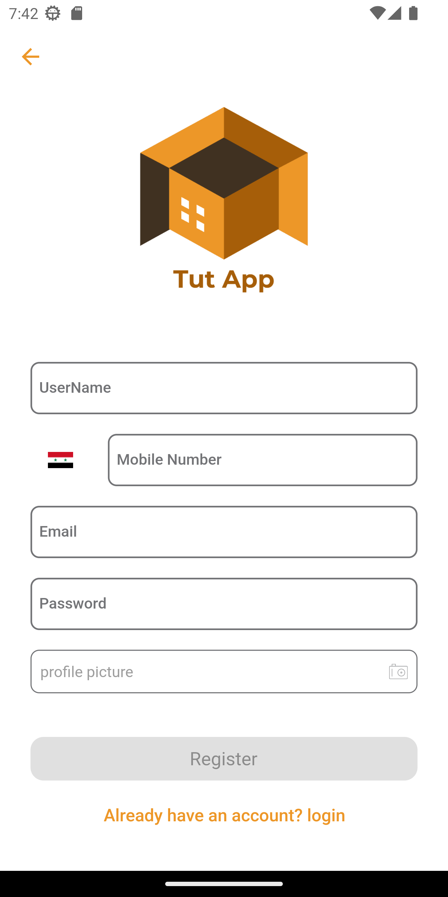
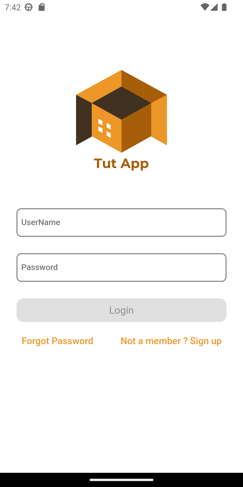
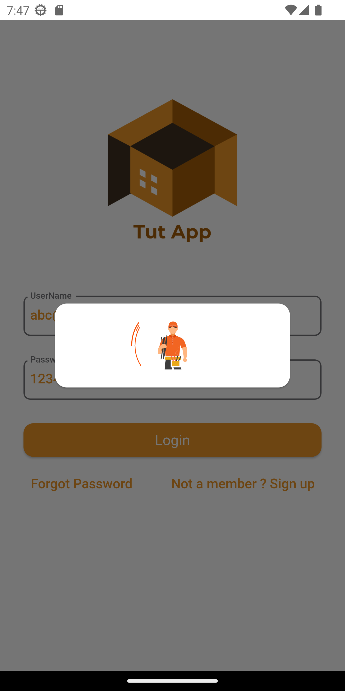
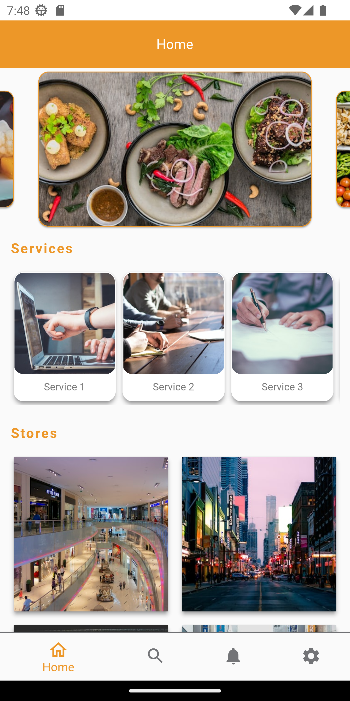
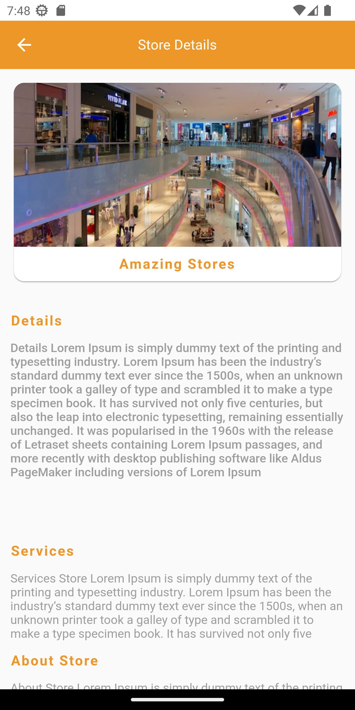
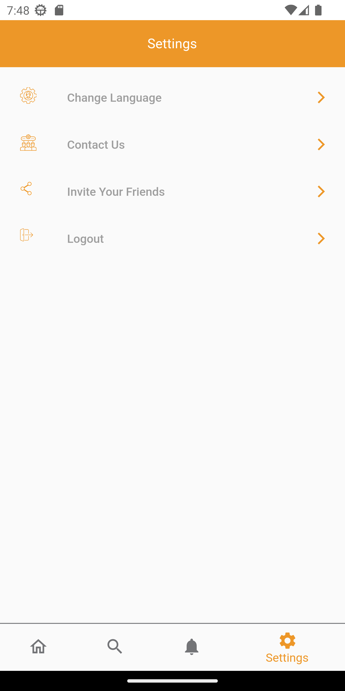

# advanced_flutter_tut

-A flutter e-commerce mock app that utilize MVVM code pattern.  
-all the implemented APIs are mock APIs created usein "app.wiremock.cloud" websit.  

# features

-this app utilize MVVM code pattern to implement clean code practices.  
-splash screen and onboarding screen.  
-the app authentication features are login, register and forget password.  
-implemented localization using easy_localization package for two languages (arabic - english).

# sceenshots
 
 
 
